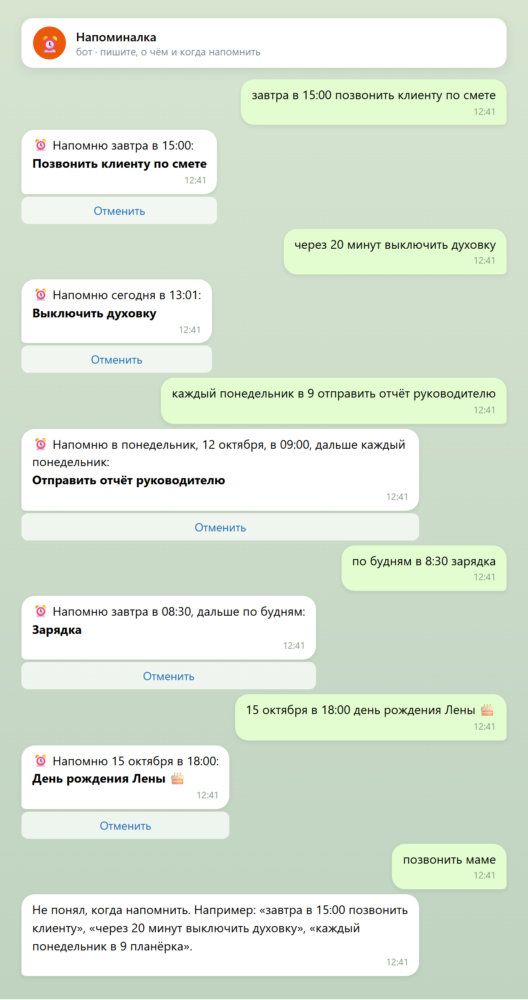
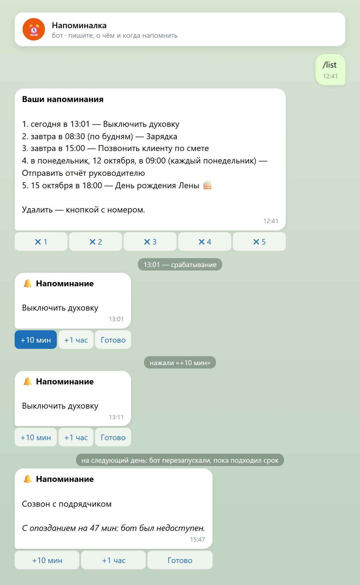
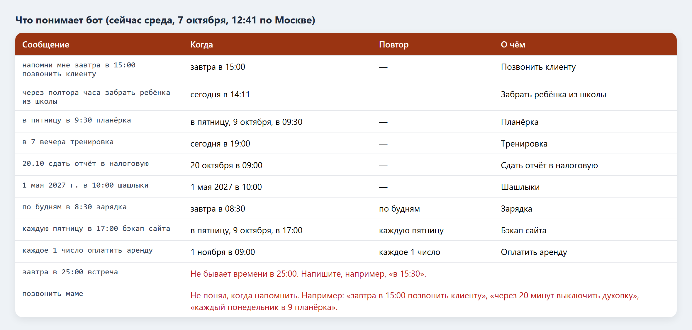
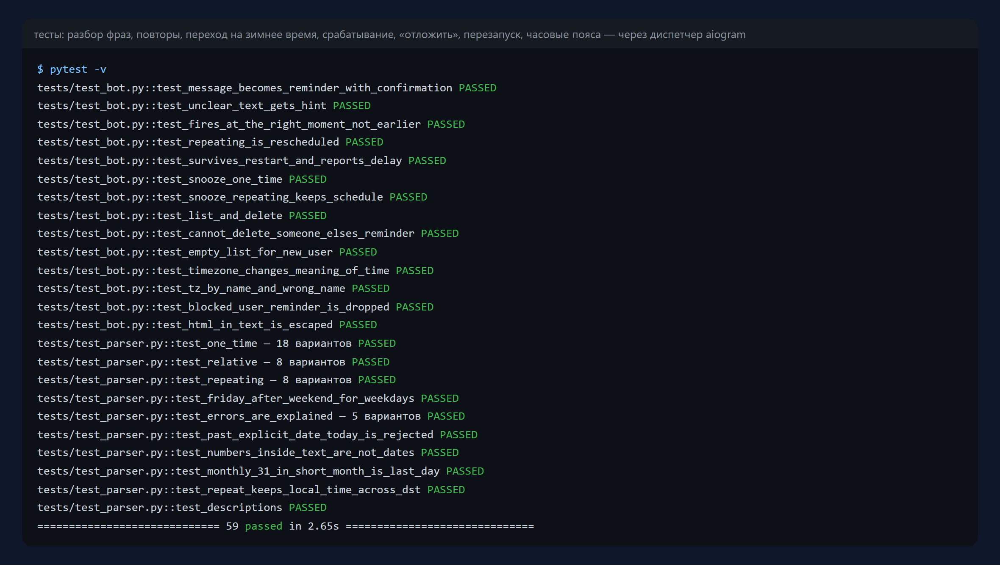

# Бот-напоминалка: пишите обычными словами

Telegram-бот, которому можно написать «завтра в 15:00 позвонить клиенту» или «каждый
понедельник в 9 отправить отчёт», и он напомнит вовремя. Без календарей и кнопок с
часами: бот сам понимает дату, время и повтор из обычной русской фразы. Напоминания
переживают перезапуск, их можно отложить на 10 минут или час, у каждого пользователя
свой часовой пояс.

> Это форк [dome272/Telegram-Reminder-Bot](https://github.com/dome272/Telegram-Reminder-Bot)
> (2020 год). Оригинал на python-telegram-bot 13 не запускается с актуальной версией библиотеки
> и терял все напоминания при перезапуске. Код переписан на aiogram 3 и SQLite, идея и лицензия
> MIT сохранены.

Python 3.11+ · aiogram 3 · SQLite · pytest · Docker

| Создание | Срабатывание |
|---|---|
|  |  |

## Что понимает



- **Разовые:** «завтра в 15:00 …», «сегодня в 18:30 …», «послезавтра …», «в пятницу в 9:30 …»,
  «15 октября в 18:00 …», «20.10 …», «1 мая 2027 г. в 10:00 …», «в 7 вечера …», «в 3 часа дня …».
- **Через интервал:** «через 20 минут …», «через полчаса …», «через полтора часа …»,
  «через 3 дня …», «через неделю …».
- **Повторы:** «каждый день в 8:00 …», «по будням в 8:30 …», «каждый понедельник в 9 …»,
  «по средам в 15 …», «каждое 1 число …» (31-е число в коротком месяце — последний день).
- Дата без времени — напоминание в 9:00. Время без даты — сегодня, а если уже прошло, то завтра.
  «5 марта», когда март уже прошёл, — следующий год.
- Непонятное и невозможное («позвонить маме», «в 25:00», «31.02») — бот объясняет, как написать правильно.

## Что умеет

- `/list` — список напоминаний с кнопками удаления.
- Кнопки у сработавшего напоминания: **+10 мин**, **+1 час**, **Готово**. Отложенный раз
  повторяющегося напоминания не сбивает его график.
- `/tz` — часовой пояс кнопками (от Калининграда до Камчатки) или любой: `/tz Europe/Berlin`.
  Повторы держат местное время и при переходе на летнее/зимнее время.
- **Ничего не теряется при перезапуске.** Сроки хранятся в базе. Если бот был выключен в
  момент срабатывания, напоминание придёт после запуска с пометкой «с опозданием на 47 мин».
- Кто заблокировал бота — его напоминания снимаются, бот не спотыкается на ошибках отправки.

## Ошибки оригинала, которые больше не повторяются

- **После перезапуска не срабатывало ни одно напоминание.** Задачи жили только в памяти
  планировщика, а `reminder.json` при старте не читался.
- **«12 PM» превращалось в полночь следующего дня.** К часу «12 pm» прибавлялось 12 → 24:00.
- **Сообщение врало о времени.** Приходило «встреча начнётся через 10 минут», хотя срабатывало
  ровно в назначенное время.
- **Часовой пояс считался от часов сервера.** Смещение прибавлялось к `datetime.now()`,
  поэтому на сервере не в UTC все напоминания съезжали.
- `/list` и `/time` у нового пользователя падали с `KeyError`.
- `pip install python-telegram-bot` из инструкции ставит версию 20+, где нет `Filters`
  и `Updater(use_context=…)`: бот падал при запуске.
- Токен нужно было вписывать прямо в код. Теперь он задаётся в `.env`.

## Запуск

```bash
pip install -r requirements.txt
cp .env.example .env      # BOT_TOKEN от @BotFather
python -m reminder
```

Docker: `docker build -t reminder . && docker run -d --env-file .env -v reminders:/data reminder`

## Тесты

```bash
pip install -r requirements-dev.txt
pytest -v
```

45 тестов на разбор фраз и ошибок, повторы, переход на зимнее время, срабатывание минута в минуту,
отложить разовое и повторяющееся, перезапуск с новой базой, часовые пояса, чужие напоминания,
заблокированный бот — через настоящий `Dispatcher` aiogram с подменённой сетью Telegram и
управляемыми часами. Всего 59 тестов.



## Лицензия

MIT, как у оригинала. Автор оригинала — [dome272](https://github.com/dome272).
